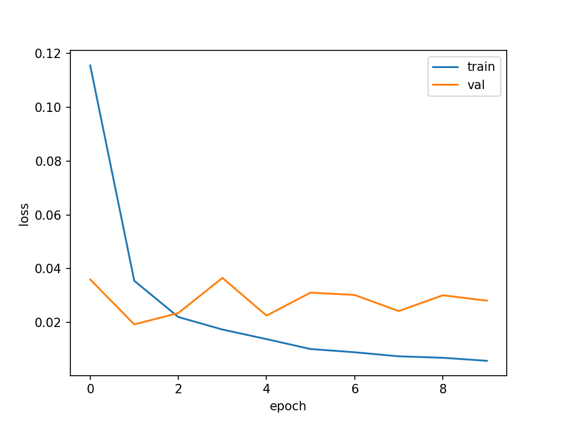
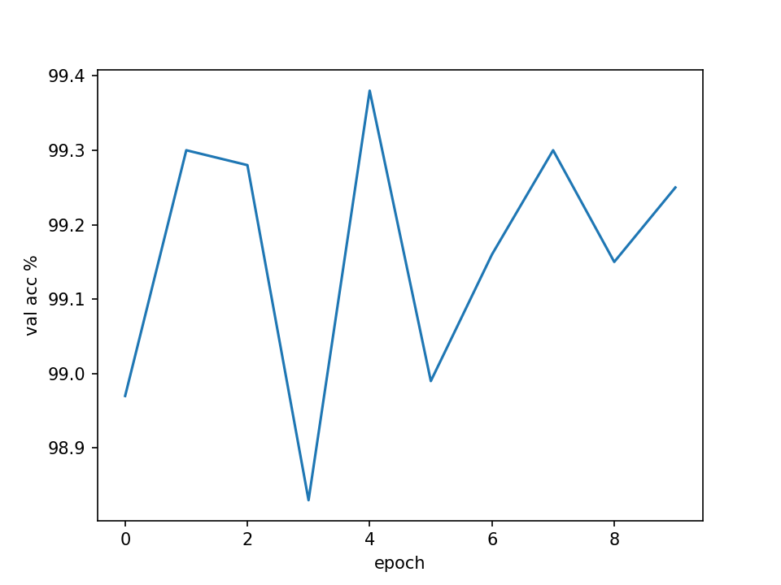
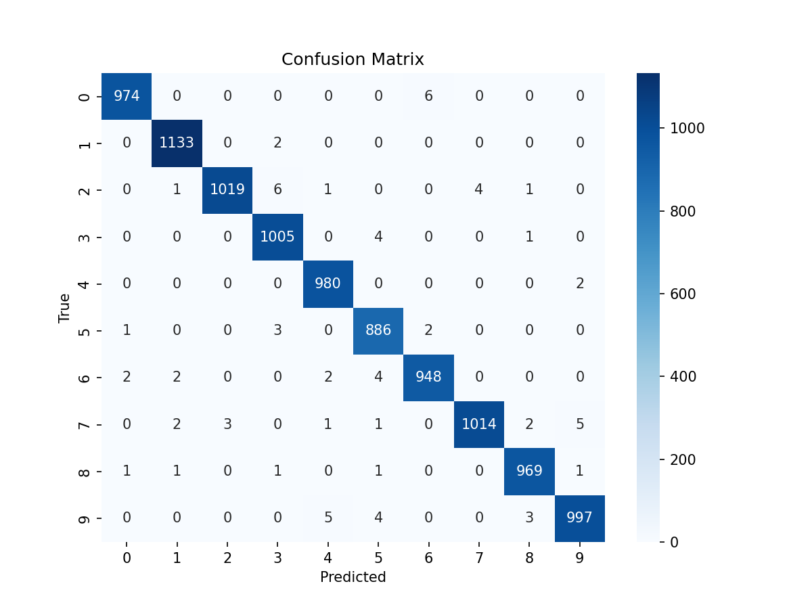

# MNIST Classification with PyTorch

## Project Overview
This project demonstrates image classification on the [MNIST dataset](http://yann.lecun.com/exdb/mnist/), a classic benchmark of handwritten digits (0–9).  
I implemented a **Convolutional Neural Network (CNN)** in PyTorch that achieves ~99% test accuracy.

---

## Dataset
- **60,000 training images** and **10,000 test images**  
- Each image: **28 × 28 grayscale**  
- Normalized using dataset statistics:  
  - Mean = `0.1307`  
  - Std = `0.3081`  

---

## Model Architecture
- Conv(1→32, 3×3), ReLU  
- Conv(32→64, 3×3), ReLU, MaxPool(2)  
- Conv(64→128, 3×3), ReLU, MaxPool(2)  
- Flatten → Linear(128×7×7 → 128), ReLU  
- Linear(128 → 10)  

---

## Training Setup
- Optimizer: **Adam** (lr=0.001)  
- Loss function: **CrossEntropyLoss**  
- Epochs: 10 (adjustable)  
- Batch size: 64  
- Device: CPU/GPU supported  

---

## Results

### Learning Curves
  


### Confusion Matrix


---

## Saved Models
- Best CNN checkpoint saved to: `models/mnist_cnn_best.pth`  

To load:
```python
model = CNNModel()
model.load_state_dict(torch.load("models/mnist_cnn_best.pth"))
model.eval()